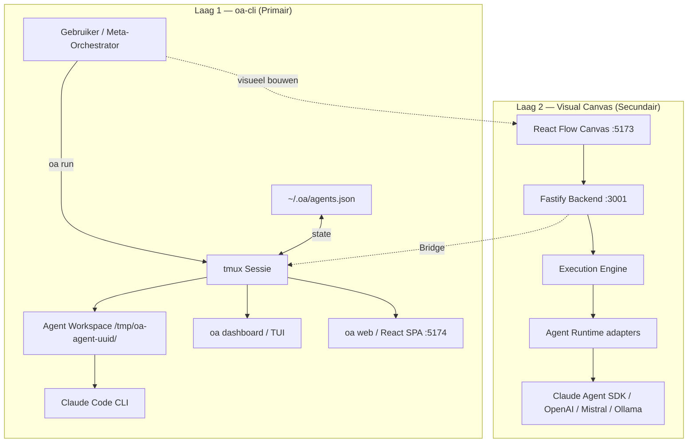

# Open-Agents — Architectuur

> **Issue**: #60 | **Versie**: 1.0 | **Datum**: 2026-03-11

---

## 1. Conceptueel Model

Open-Agents bestaat uit twee lagen die elkaar aanvullen:



**Laag 1 — oa-cli**: Python CLI op basis van tmux. Elke agent krijgt een eigen tmux-window en geïsoleerde workspace. Geen API-key nodig — draait op je Claude Code-abonnement.

**Laag 2 — Visual Canvas**: TypeScript monorepo (`packages/`) met drag-and-drop canvas voor complexe workflows. Gebruikt de Fastify backend als orchestratielaag en ondersteunt meerdere LLM-providers.

---

## 2. Decision Tree — wanneer wat gebruiken?

```
Nieuwe taak binnengekomen
│
├── Eenvoudig, enkelvoudig, < 5 minuten?
│   └── oa run "taak" --model claude/sonnet --direct
│
├── Complex, meerdere deeltaken, parallel uitvoerbaar?
│   └── oa pipeline "taak"
│       → Planner → Workers (parallel) → Combiner
│
├── Wil je de agent autonoom zijn eigen workers laten spawnen?
│   └── oa delegate "taak"
│       → Orchestrator-agent beheert zijn eigen workers
│
├── Snelle research / wegwerp-analyse / pre-flight check?
│   └── Claude Code Agent tool (ingebouwd)
│       Let op: niet zichtbaar in oa status, geen messaging
│
└── Visuele workflow bouwen of meerdere providers gebruiken?
    └── Visual Canvas (pnpm dev)
        → Drag-and-drop nodes op React Flow canvas
```

**Vuistregel**:
- `oa run` → enkelvoudige taak, schrijf direct naar project
- `oa pipeline` → complexe taak met automatische decompositie
- `oa delegate` → taak waarbij de orchestrator-agent zelf workers inzet
- Visual Canvas → visueel orkestreren, multi-provider, geavanceerd

---

## 3. Agent Isolatie en Flat Spawning

### Agent Isolatie

Elke agent draait in een volledig geïsoleerde omgeving:

```
oa run "taak" --name mijn-agent
    │
    ├── Workspace aanmaken: /tmp/oa-agent-<uuid>/
    │   ├── CLAUDE.md  ← taak-specifiek, gegenereerd door workspace builder
    │   └── output/    ← agent schrijft hier zijn resultaten
    │
    ├── tmux window: eigen pane, eigen shell
    │
    └── Claude Code start in die workspace
        └── Ziet alleen zijn eigen CLAUDE.md — geen context van andere agents
```

Agents weten niet van elkaars bestaan, tenzij expliciet geconfigureerd via `oa send`/`oa inbox`.

### Flat Spawning (L-004, Issue #9/#11)

**Kritieke regel**: spawn alle agents direct vanuit de top-level sessie. Nooit genest.

```
✅ CORRECT — Flat spawning:
Meta-orchestrator (Claude Code sessie)
├── worker-1  (oa run)
├── worker-2  (oa run)
└── worker-3  (oa run)

❌ FOUT — Nested spawning (werkt NIET):
Meta-orchestrator → orchestrator-agent (oa run) → worker (oa run interne Agent tool)
```

**Waarom**: een oa-agent die sub-agents spawnt via Claude Code's ingebouwde Agent tool, maakt agents die onzichtbaar zijn voor `oa status` en niet kunnen communiceren via messaging.

**Uitzondering**: `oa delegate` — dit is de enige gecontroleerde manier om een orchestrator-agent zijn eigen workers te laten spawnen, via een dedicated bridge.

---

## 4. State Management

### agents.json — centrale state store

Alle agent-informatie wordt bijgehouden in `~/.oa/agents.json`:

```json
{
  "agents": [
    {
      "id": "uuid",
      "name": "mijn-agent",
      "status": "running",
      "task": "Taakbeschrijving",
      "workspace": "/tmp/oa-agent-uuid/",
      "model": "claude/sonnet",
      "started_at": "2026-03-11T10:00:00",
      "parent": null
    }
  ]
}
```

**Statuswaarden**: `running` | `done` | `error` | `killed`

### Werkcyclus van een agent

```
oa run "taak"          → status: running   → workspace aangemaakt
                       → agent werkt       → output/ gevuld
oa status              → overzicht van alle agents + status
oa collect <naam>      → toont output/output.md van completed agent
oa clean               → verwijdert workspaces van afgeronde agents
```

### Commando's voor state-inspectie

| Commando | Functie |
|----------|---------|
| `oa status` | Overzichtstabel: naam, status, taak, duratie, workspace |
| `oa collect <naam>` | Output van afgeronde agent ophalen |
| `oa watch <naam>` | Live output van lopende agent streamen |
| `oa attach <naam>` | Naar tmux-window van agent schakelen |
| `oa dashboard` | Textual TUI met real-time agent-overzicht |

---

## 5. oa-cli Quick Reference

### Sessie & Orchestratie

| Commando | Beschrijving |
|----------|-------------|
| `oa start` | tmux-sessie starten |
| `oa stop` | Sessie stoppen (triggert guardian agents) |
| `oa status` | Alle agents tonen (naam, status, taak, duratie) |
| `oa dashboard` | Interactief TUI-dashboard openen |
| `oa web` | React web UI starten op localhost:5174 |
| `oa version` | CLI-versie tonen |

### Agents Spawnen & Beheren

| Commando | Beschrijving |
|----------|-------------|
| `oa run "<taak>"` | Agent spawnen met taak |
| `oa run "<taak>" -n <naam>` | Agent met specifieke naam |
| `oa run "<taak>" --model claude/sonnet` | Model opgeven |
| `oa run "<taak>" --direct` | Direct naar project schrijven (geen proposal) |
| `oa pipeline "<taak>"` | Pipeline: Planner → Workers → Combiner |
| `oa delegate "<taak>"` | Orchestrator-agent spawnen die zelf workers beheert |
| `oa kill <naam>` | Agent stoppen |
| `oa clean` | Workspaces van afgeronde agents opruimen |

### Output & Monitoring

| Commando | Beschrijving |
|----------|-------------|
| `oa collect <naam>` | Output van afgeronde agent ophalen |
| `oa watch <naam>` | Live output streamen |
| `oa attach <naam>` | Naar tmux-window schakelen |
| `oa review <naam>` | Proposals van agent inzien |
| `oa apply <naam>` | Proposals toepassen op codebase |
| `oa apply <naam> --dry-run` | Preview van apply (geen wijzigingen) |

### Communicatie

| Commando | Beschrijving |
|----------|-------------|
| `oa send <agent> "<bericht>" --from <naam>` | Direct bericht naar agent |
| `oa inbox <agent>` | Berichten van agent lezen |
| `oa broadcast "<bericht>" --from <naam>` | Bericht naar alle agents |

### Model Selectie

| Model string | Omschrijving |
|-------------|-------------|
| `claude` | Claude Code CLI — standaard, subscription |
| `claude/opus` | Claude Opus 4.6 — maximale redenering |
| `claude/sonnet` | Claude Sonnet 4.6 — balans kwaliteit/snelheid |
| `claude/haiku` | Claude Haiku 4.5 — snel, goedkoop, structuur |
| `ollama/<model>` | Lokaal Ollama-model |

---

## Zie ook

- [README.md](../README.md) — Project introductie en quick start
- [DECISIONS.md](DECISIONS.md) — Architectuurbeslissingen (D-001+)
- [PRINCIPLES.md](PRINCIPLES.md) — 11 design uitgangspunten
- [ROADMAP.md](ROADMAP.md) — Projectstatus
