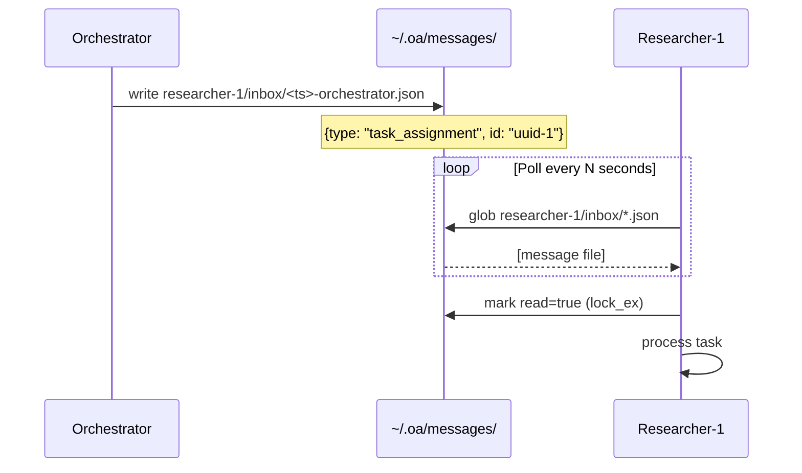
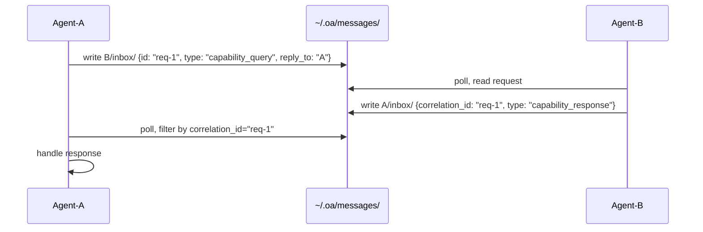
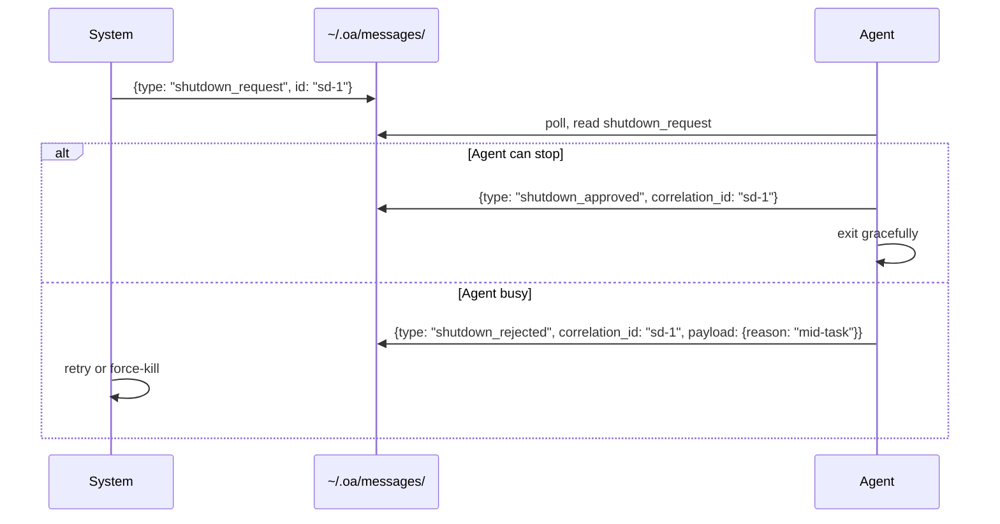

# Inter-Agent Communication Protocol — Research Report

> **Issue**: #48 | **Date**: 2026-03-11 | **Author**: research-inter-agent (claude-sonnet-4-6)
> **Related**: #49 (Message Bus Evaluation), #50 (Agent Registry), #57 (A2A Compatibility)

---

## Table of Contents

1. [Current State](#1-current-state)
2. [Protocol Requirements](#2-protocol-requirements)
3. [Message Envelope Design](#3-message-envelope-design)
4. [Sequence Diagrams](#4-sequence-diagrams)
5. [Paradigm Comparison](#5-paradigm-comparison)
6. [PoC Implementation](#6-poc-implementation)
7. [Decision](#7-decision)

---

## 1. Current State

Open-Agents implements inter-agent communication via **file-based message passing**. Each message is a JSON
file written to `~/.oa/messages/<recipient>/inbox/<timestamp>-<sender>.json`. Broadcast messages are
written to `~/.oa/messages/_broadcast/` and individually delivered to each running agent's inbox.

### CLI surface

```bash
oa send <to> "<message>" --from <sender>    # point-to-point
oa inbox <name> [--unread]                  # read inbox
oa broadcast "<message>" --from <sender>    # fan-out to all running agents
```

### Current message structure (on disk)

```json
{
  "from": "orchestrator",
  "to": "researcher-1",
  "content": "Start research on topic X",
  "timestamp": 1741694400.123,
  "read": false,
  "metadata": { "type": "task_assignment" }
}
```

### Strengths and weaknesses

| Strengths | Weaknesses |
|-----------|------------|
| Zero dependencies | No protocol contract — metadata.type is freeform |
| Fully persistent | No correlation IDs — request-response tracked manually |
| Human-readable and debuggable | No message versioning — schema changes break silently |
| fcntl locking prevents corruption | Polling-only — no push delivery |
| WSL2 compatible (Linux layer) | No routing — broadcast reaches ALL agents |

---

## 2. Protocol Requirements

| Requirement | Priority | Rationale |
|-------------|----------|-----------|
| Structured message types | High | Distinguish task assignments from shutdown requests |
| Correlation IDs | High | Request-response patterns need reliable tracking |
| Message versioning | Medium | Schema evolution without breaking existing agents |
| Broadcast filtering | Medium | Not every broadcast is relevant to every agent |
| TTL / expiry | Low | Stale messages should not accumulate |
| Backward compatibility | High | Existing `oa send`/`oa inbox` must keep working |

### Message type taxonomy

| Category | Types |
|----------|-------|
| **Task** | `task_assignment`, `task_result`, `task_error`, `task_cancelled` |
| **Coordination** | `status_update`, `progress_report`, `handoff` |
| **Lifecycle** | `shutdown_request`, `shutdown_approved`, `shutdown_rejected`, `heartbeat` |
| **Discovery** | `capability_query`, `capability_response` |
| **Broadcast** | `broadcast_announcement`, `broadcast_shutdown`, `broadcast_context` |

---

## 3. Message Envelope Design

### Design principles

1. **Envelope + payload separation** — routing metadata in the envelope; content in the payload
2. **Typed messages** — every message has an explicit `type` from a defined taxonomy
3. **Correlation support** — `correlation_id` links requests to responses
4. **Schema version** — `schema_version` enables non-breaking evolution
5. **Backward compat** — `content` remains a plain string for existing CLI display

### Full message envelope (JSON Schema)

```json
{
  "$schema": "https://json-schema.org/draft/2020-12",
  "$id": "oa:message:v1",
  "title": "Open-Agents Message Envelope v1",
  "type": "object",
  "required": ["schema_version", "id", "from", "to", "type", "content", "timestamp"],
  "properties": {
    "schema_version": { "type": "string", "enum": ["1.0"] },
    "id":             { "type": "string", "description": "UUID v4 — unique message identifier" },
    "from":           { "type": "string", "description": "Sender agent name (slug)" },
    "to":             { "type": "string", "description": "Recipient name or '_broadcast'" },
    "type":           { "type": "string", "description": "Message type from taxonomy enum" },
    "content":        { "type": "string", "description": "Human-readable body (plain text)" },
    "payload":        { "type": "object", "description": "Structured data (type-specific)" },
    "correlation_id": { "type": "string", "description": "UUID of originating request" },
    "reply_to":       { "type": "string", "description": "Agent that should receive replies" },
    "timestamp":      { "type": "number", "description": "Unix epoch float" },
    "expires_at":     { "type": "number", "description": "Unix epoch float — TTL cutoff" },
    "read":           { "type": "boolean", "default": false },
    "priority":       { "type": "string", "enum": ["low", "normal", "high", "urgent"] },
    "tags":           { "type": "array", "items": { "type": "string" } }
  }
}
```

### Minimal valid message (backward-compatible)

```json
{
  "schema_version": "1.0",
  "id": "550e8400-e29b-41d4-a716-446655440000",
  "from": "orchestrator",
  "to": "researcher-1",
  "type": "direct_message",
  "content": "Start research on topic X",
  "timestamp": 1741694400.123
}
```

---

## 4. Sequence Diagrams

### 4.1 Direct Messaging



### 4.2 Request-Response with Correlation



### 4.3 Shutdown Handshake



---

## 5. Paradigm Comparison

| Paradigm | Latency | Persistence | Dependencies | Fit for Open-Agents |
|----------|---------|-------------|--------------|---------------------|
| **File-based (current)** | 50–200ms | ✅ | None | ✅ (baseline) |
| **Actor Model** | <1ms (in-process) | ❌ | None (runtime needed) | ⚠️ tmux incompatible |
| **MQTT** | 1–5ms | QoS-dependent | Broker daemon | ❌ adds ops overhead |
| **gRPC** | <1ms | ❌ (stateless) | grpcio + port per agent | ❌ tmux incompatible |
| **JSON-RPC 2.0** | Transport-dependent | Transport-dependent | None (format only) | ✅ partial adoption |

### Actor Model

Open-Agents already implements informal Actor Model semantics: agents have named mailboxes
(`~/.oa/messages/<name>/inbox/`), communicate only via messages, and share no state. The proposed typed
envelope formalizes this pattern. Full actor semantics (push delivery, pattern-match dispatch) would require
an in-process dispatcher — incompatible with the tmux-based architecture.

### MQTT

MQTT's topic tree (`agent/inbox/#`) maps naturally to Open-Agents routing. Wildcard subscriptions would
enable clean broadcast filtering. However, MQTT requires a broker daemon (Mosquitto). This adds operational
complexity for a local developer tool. Revisit when agents run on multiple machines.

### gRPC

gRPC provides strong typing via Protobuf and <1ms latency. Each agent would need to expose an HTTP/2
server, which conflicts with oa-cli's model where agents are transient tmux sessions without network ports.
Not recommended for MVP.

### JSON-RPC 2.0

JSON-RPC 2.0 defines: `{jsonrpc: "2.0", method: "...", params: {...}, id: 1}`. The proposed v1 envelope
adopts its correlation model (`id`, `correlation_id`) and adapts it: `method` → `type` enum (richer),
`params` → `payload` (untyped object). The key difference: the v1 envelope is transport-agnostic and
works over files today, SQLite tomorrow, Redis later. Full JSON-RPC 2.0 would require an HTTP server.

---

## 6. PoC Implementation

```python
# oa-cli/src/open_agents/messaging_v2.py  (drop-in extension of messaging.py)
from __future__ import annotations
import json, time, uuid
from pathlib import Path
from typing import Literal, Optional
from ._filelock import lock_ex, lock_sh, lock_un
from .config import OA_DIR

MESSAGES_DIR = OA_DIR / "messages"

MessageType = Literal[
    "task_assignment", "task_result", "task_error", "task_cancelled",
    "status_update", "progress_report", "handoff",
    "shutdown_request", "shutdown_approved", "shutdown_rejected", "heartbeat",
    "capability_query", "capability_response",
    "broadcast_announcement", "broadcast_shutdown", "broadcast_context",
    "direct_message",
]


def send_message(
    sender: str,
    recipient: str,
    content: str,
    msg_type: MessageType = "direct_message",
    payload: Optional[dict] = None,
    correlation_id: Optional[str] = None,
    reply_to: Optional[str] = None,
    metadata: Optional[dict] = None,   # legacy compat
) -> Path:
    if metadata and not payload:
        payload = metadata

    inbox = MESSAGES_DIR / recipient / "inbox"
    inbox.mkdir(parents=True, exist_ok=True)

    msg: dict = {
        "schema_version": "1.0",
        "id": str(uuid.uuid4()),
        "from": sender,
        "to": recipient,
        "type": msg_type,
        "content": content,
        "timestamp": time.time(),
        "read": False,
    }
    if payload:
        msg["payload"] = payload
    if correlation_id:
        msg["correlation_id"] = correlation_id
    if reply_to:
        msg["reply_to"] = reply_to

    ts_ms = int(msg["timestamp"] * 1000)
    path = inbox / f"{ts_ms}-{sender}.json"
    with open(path, "w") as f:
        lock_ex(f)
        try:
            json.dump(msg, f, indent=2)
        finally:
            lock_un(f)
    return path


def read_inbox(
    agent_name: str,
    unread_only: bool = False,
    limit: int = 50,
    msg_type: Optional[MessageType] = None,
    correlation_id: Optional[str] = None,
) -> list[dict]:
    messages = []
    inbox = MESSAGES_DIR / agent_name / "inbox"
    if not inbox.exists():
        return []
    for msg_file in inbox.glob("*.json"):
        try:
            with open(msg_file) as f:
                lock_sh(f)
                try:
                    msg = json.load(f)
                finally:
                    lock_un(f)
            if msg.get("expires_at") and time.time() > msg["expires_at"]:
                continue
            if unread_only and msg.get("read", False):
                continue
            if msg_type and msg.get("type") != msg_type:
                continue
            if correlation_id and msg.get("correlation_id") != correlation_id:
                continue
            msg["_file"] = str(msg_file)
            messages.append(msg)
        except (json.JSONDecodeError, OSError):
            continue
    messages.sort(key=lambda m: m.get("timestamp", 0), reverse=True)
    return messages[:limit]


def wait_for_reply(
    agent_name: str,
    request_id: str,
    timeout: float = 30.0,
    poll_interval: float = 0.5,
) -> Optional[dict]:
    """Block until a reply with matching correlation_id arrives, or timeout."""
    deadline = time.time() + timeout
    while time.time() < deadline:
        replies = read_inbox(agent_name, unread_only=True, correlation_id=request_id)
        if replies:
            return replies[0]
        time.sleep(poll_interval)
    return None
```

### Usage: task assignment + response

```python
# Orchestrator sends task
msg_path = send_message(
    sender="orchestrator",
    recipient="researcher-1",
    content="Research inter-agent protocol options",
    msg_type="task_assignment",
    payload={"issue": 48, "output_path": "/tmp/result.md"},
    reply_to="orchestrator",
)
request_id = json.loads(msg_path.read_text())["id"]

# Researcher replies
send_message(
    sender="researcher-1",
    recipient="orchestrator",
    content="Research complete",
    msg_type="task_result",
    correlation_id=request_id,
    payload={"output_path": "/tmp/result.md"},
)

# Orchestrator waits for reply
reply = wait_for_reply("orchestrator", request_id, timeout=120.0)
```

---

## 7. Decision

### Recommendation: Adopt v1 Message Envelope

**Adopt the v1 message envelope as the canonical inter-agent protocol for Open-Agents.**

| Property | Assessment |
|----------|------------|
| Backward-compatible | ✅ `direct_message` default maps to current behavior |
| Drop-in | ✅ Same function signatures as `messaging.py` |
| Typed | ✅ `type` enum replaces ad-hoc `metadata.type` |
| Correlated | ✅ `id` + `correlation_id` enable clean request-response |
| Versioned | ✅ `schema_version: "1.0"` allows future evolution |
| Transport-agnostic | ✅ File today, SQLite (#49) or Redis tomorrow |

### What NOT to adopt (and why)

| Protocol | Decision | Reason |
|----------|----------|--------|
| gRPC | ❌ Reject | Requires HTTP/2 server per agent; tmux incompatible |
| MQTT | ❌ Reject (MVP) | Requires broker daemon |
| JSON-RPC 2.0 (native) | ⚠️ Partial | Adopt correlation model; keep file transport |
| Actor Model (full runtime) | ⚠️ Partial | Envelope adopts semantics; runtime not feasible |
| A2A JSON-RPC | ❌ Internal | External interop only (see #57) |

### Migration plan

| Phase | Scope | Duration |
|-------|-------|----------|
| **Phase 1** | Deploy `messaging_v2.py`. Wrap `messaging.py` to proxy calls. New agents use `msg_type=`. | 1 day |
| **Phase 2** | Update agent templates; add `oa inbox --type <type>` CLI filter. | 1 sprint |
| **Phase 3** | Add `wait_for_reply()` to orchestrator patterns; document in AGENTS.md. | 1 sprint |
| **Phase 4** | If message volume grows, swap file backend for SQLite (per #49). Protocol unchanged. | When needed |

### Decision record (D-048)

> **D-048: Inter-Agent Communication Protocol**
> **Chosen**: Custom JSON envelope v1 — typed messages, correlation IDs, schema versioning.
> **Transport**: File-based (unchanged) — protocol is transport-agnostic.
> **Backward compat**: Fully maintained — `direct_message` default preserves current behavior.
> **Not chosen**: gRPC (infra overhead), MQTT (broker dependency), native JSON-RPC 2.0 (no type enum).
> **Schema location**: `docs/schemas/message-envelope-v1.json` (to be created on implementation).

---

*Written by research-inter-agent (claude-sonnet-4-6) for Open-Agents issue #48. Date: 2026-03-11.*
*Related: #49 message-bus.md · #50 agent-registry.md · #57 a2a-compatibility.md*
