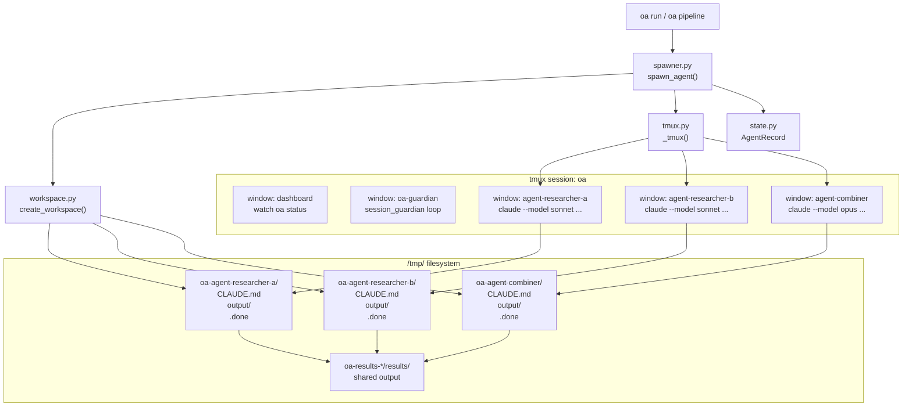

# Tmux as Agent Container Runtime — Research Report

**Issue:** #51
**Date:** 2026-03-11
**Status:** Final

---

## 1. Executive Summary

Open-Agents uses tmux as its agent container runtime: every agent runs as a tmux window inside a single named session (`oa`). This approach is pragmatic, zero-dependency, and works well for the current scale (≤20 concurrent agents). Tmux cannot replicate filesystem isolation, resource limits, or networked execution that Docker provides — but it also requires no daemon, no image build, and no OS-level privilege. The recommendation is to **stay with tmux as the primary runtime** while formalising the session layout as a YAML schema, adding a spawning script for automated window management, and treating Docker as an opt-in isolation layer rather than a replacement.

---

## 2. How Open-Agents Uses Tmux Today

### 2.1 Session Architecture

All agents share one tmux session named `oa`. The session is created by `oa start` (`tmux.py:start_session`) and destroyed by `oa stop`. Inside this session, windows are created dynamically per agent. The naming convention is:

| Window | Purpose |
|--------|---------|
| `dashboard` | Runs `watch -n3 oa status` — live status view |
| `oa-guardian` | Self-healing loop; restarts `session_guardian.py` on crash |
| `agent-<name>` | One window per running agent |

Source: `tmux.py:start_session`, `spawner.py:spawn_agent`

### 2.2 Agent Spawn Flow

When `oa run` is called, `spawner.py:spawn_agent` executes the following steps:

1. **Validate** — check session exists, name format (`[a-z0-9-]`, max 62 chars), depth limit, duplicate guard
2. **Create workspace** — `workspace.py:create_workspace` creates a `/tmp/oa-agent-<name>/` directory with:
   - `CLAUDE.md` — identity, task, quality rules, anti-patterns
   - `output/` — for result files
   - `.claude/settings.json` — bypass-permissions mode, Agent-tool blocker hook
3. **Create tmux window** — `new-window -t oa -n agent-<name> -P -F '#{window_index}'`
4. **Write run script** — agent command written to `.oa-run.sh` (avoids tmux send-keys quoting issues)
5. **Send to window** — `send-keys -t oa:<window_index> <script_path> Enter`
6. **Register in state** — JSON state file updated with `AgentRecord`

### 2.3 Agent Hierarchy

Agents can spawn sub-agents up to depth 5 (configurable). The hierarchy is tracked via `AgentRecord.depth` and `AgentRecord.lineage`. Shared results flow through a shared `/tmp/oa-results-*/results/` directory. Sub-agents must use `oa run --parent <name> --direct` — the built-in Claude Code Agent tool is blocked via a PreToolUse hook.

### 2.4 Guardian & Session Lifecycle

The `oa-guardian` window runs a permanent loop that calls `session_guardian.py`. It:
- Writes heartbeats to `~/.oa/session.heartbeat` every 5 minutes
- Detects crashed agents and can restart them
- Cleans up stale workspaces

On terminal detach, a tmux hook calls `session_cleanup.py --mode detach`. On `oa stop`, the lock file and heartbeat are removed, and the tmux session is killed.

---

## 3. Session Layout YAML Format

A proposed schema for defining multi-agent tmux layouts declaratively:

```yaml
# oa-session.yaml — declarative session layout
# Used for: pre-planned agent topologies, pipeline orchestration, team definitions

session:
  name: oa
  windows:
    - name: dashboard
      command: "watch -t -n3 oa status"
      permanent: true   # never killed by oa clean

    - name: oa-guardian
      command: "while true; do python3 -m open_agents.session_guardian; sleep 5; done"
      permanent: true

agents:
  - name: researcher-a
    model: claude/sonnet
    task: "Investigate tmux session limits"
    parent: null
    depth: 0
    workspace_prefix: /tmp/oa-agent-
    shared_results: /tmp/oa-results-pipeline/results

  - name: researcher-b
    model: claude/sonnet
    task: "Compare Zellij vs tmux for agent workloads"
    parent: null
    depth: 0
    shared_results: /tmp/oa-results-pipeline/results

  - name: combiner
    model: claude/opus
    task: "Combine research from researcher-a and researcher-b"
    parent: null
    depth: 0
    depends_on:
      - researcher-a
      - researcher-b
    shared_results: /tmp/oa-results-pipeline/results

pipeline:
  strategy: parallel-then-combine
  timeout_minutes: 60
  on_failure: write_error_and_continue
```

This format is forward-compatible with `oa pipeline` and could replace the current programmatic pipeline builder in `pipeline.py`.

---

## 4. Spawning Script Concept

A dedicated spawning script could automate session window management beyond what the current `spawner.py` does inline. Concept:

```bash
#!/bin/bash
# oa-spawn-window.sh — low-level tmux window lifecycle manager
# Called by spawner.py; separates tmux concerns from Python logic

SESSION="oa"
AGENT_NAME="$1"
SCRIPT_PATH="$2"
WINDOW_NAME="agent-${AGENT_NAME}"

# 1. Create window, capture index
WINDOW_INDEX=$(tmux new-window -t "$SESSION" -n "$WINDOW_NAME" -P -F '#{window_index}')

# 2. Set window environment variables
tmux setenv -t "$SESSION:$WINDOW_INDEX" OA_AGENT_NAME "$AGENT_NAME"
tmux setenv -t "$SESSION:$WINDOW_INDEX" OA_SESSION "$SESSION"

# 3. Send script
tmux send-keys -t "$SESSION:$WINDOW_INDEX" "$SCRIPT_PATH" Enter

# 4. Return window index for state registration
echo "$WINDOW_INDEX"
```

Benefits over current inline approach:
- Centralises tmux window policy in one place
- Allows setting per-window environment variables (useful for agent identity injection)
- Easier to test in isolation

---

## 5. Tmux vs Zellij — Runtime Comparison

Zellij is a modern terminal multiplexer written in Rust with a plugin system. Here is how it compares for agent workloads:

| Feature | Tmux | Zellij |
|---------|------|--------|
| **Maturity** | 15+ years, ubiquitous | 2021, growing adoption |
| **Availability** | Pre-installed on most Linux | Requires installation |
| **Session model** | Named sessions, windows, panes | Sessions, tabs, panes, layouts |
| **Scripting API** | `tmux` CLI + `send-keys` | `zellij action` CLI (limited) |
| **Config format** | `~/.tmux.conf` (opaque) | KDL (readable, typed) |
| **Programmatic control** | Mature, battle-tested | Immature — `send-keys` equivalent is fragile |
| **Plugin system** | Via external scripts | Native WASM plugins |
| **WSL2 compatibility** | Excellent | Mostly works, minor font issues |
| **Window targeting** | Stable by index and name | Less stable — name collisions possible |
| **Non-interactive execution** | `tmux new-session -d` works well | Requires workarounds |
| **Resource overhead** | ~2 MB per session | ~10 MB per session |
| **`send-keys` equivalent** | `tmux send-keys -t target` | `zellij action write-chars` (unreliable for scripts) |

**Conclusion for agent workloads:** Zellij's programmatic control is too immature. Open-Agents relies on precise window targeting (`-t session:index`), non-interactive background execution, and scripted `send-keys`. All of these work reliably in tmux and are fragile or unsupported in Zellij.

---

## 6. Architecture Diagram

Current tmux architecture:



---

## 7. Tmux Limitations

Tmux is a terminal multiplexer, not a container runtime. The following are genuine limitations in the context of agent execution:

### 7.1 No Filesystem Isolation
All agents share the host filesystem. A misbehaving agent can read or write any file the user owns. Docker provides mount namespaces and `--read-only` flags. Current mitigation: agents run in `/tmp/oa-agent-*/` workspaces, but this is convention, not enforcement.

### 7.2 No Resource Limits
Tmux cannot set CPU or memory limits per window. A runaway agent consuming 100% CPU or filling `/tmp` affects all other agents. Docker provides `--cpus` and `--memory` cgroups. Current mitigation: none — `docker_runtime.py` exists but is not wired into the default spawn path.

### 7.3 No Network Isolation
All agents share the host network stack. An agent could make outbound requests to arbitrary endpoints. Docker's `--network none` disables this. Current mitigation: not enforced.

### 7.4 No Process Namespace Isolation
Agents can see each other's processes via `ps`. Sensitive environment variables set in one window may be visible in `/proc`. Docker provides PID and IPC namespace isolation.

### 7.5 Window Count at Scale
Tmux windows are lightweight but the `oa status` watcher polls all windows. At 50+ concurrent agents, the dashboard refresh becomes slow. The current guardian scans all windows linearly.

### 7.6 Crash Recovery is Best-Effort
If the tmux session is killed (e.g., host reboot), all agents are lost. The checkpoint system (`checkpoint.py`) tracks task state but cannot resume a running Claude Code process. Docker containers can be restarted; tmux windows cannot.

### 7.7 Output Capture is Indirect
Agent output is captured to `output/result.md` by the agent itself. There is no reliable way to capture stdout from a tmux window programmatically (requires `capture-pane`, which is fragile). Docker `logs` captures all stdout/stderr natively.

---

## 8. What Docker Can Do That Tmux Cannot

| Capability | Docker | Tmux |
|------------|--------|------|
| Filesystem namespace | Yes (`--read-only`, volume mounts) | No |
| Memory limit | Yes (`--memory=2g`) | No |
| CPU limit | Yes (`--cpus=1.0`) | No |
| Network isolation | Yes (`--network none`) | No |
| Process isolation | Yes (PID namespace) | No |
| Reproducible environment | Yes (image layers) | No |
| Restart on crash | Yes (`--restart unless-stopped`) | No |
| Structured log capture | Yes (`docker logs`) | Indirect via files |
| Cross-host execution | Partial (via registry) | No (SSH-based workaround) |

`docker_runtime.py` already implements the Docker API (`DockerAgentRuntime`). It is currently not wired into the default `spawn_agent` path.

---

## 9. Recommendation

### Stay with Tmux as Primary Runtime

Tmux satisfies Open-Agents' core requirements: low overhead, no daemon, works in WSL2, supports interactive observation (`oa attach`, `oa watch`), and has a stable programmatic API. The current implementation in `tmux.py` and `spawner.py` is correct and maintainable.

### Formalise the Session Layout as YAML

Introduce `oa-session.yaml` (Section 3) as an optional declarative format for pre-planned pipelines and team layouts. This enables reproducible multi-agent topologies without hardcoded Python.

### Extend Docker as an Opt-In Isolation Layer

`docker_runtime.py` already exists. Wire it in as a `--runtime docker` flag on `oa run`:

```bash
oa run "task" --name my-agent --model claude/sonnet --runtime docker
```

When `--runtime docker` is used: spawn the agent in a Docker container with `--network none` and configurable resource limits. The tmux window still exists for observability (shows `docker logs -f`). This gives isolation where needed without forcing Docker on all users.

### Do NOT Migrate to Zellij

Zellij's programmatic control is insufficient for production agent workloads. The risk-to-reward ratio of migrating is too high given tmux's maturity and current deep integration.

### Spawning Script Extraction

Extract the tmux window lifecycle (currently inline in `spawner.py:spawn_agent`) into a dedicated helper (`tmux_window.py` or the existing `tmux.py`). This reduces coupling and makes window management easier to test.

---

## 10. Summary Table

| Question | Answer |
|----------|--------|
| How does OA use tmux? | One session `oa`, one window per agent, guardian + dashboard windows |
| Session layout YAML? | Proposed format in Section 3; not yet implemented |
| Spawning script? | Currently inline in `spawner.py`; extraction recommended |
| Tmux vs Zellij? | Tmux wins for agent workloads — programmatic API is mature |
| Tmux limits? | No filesystem/resource/network isolation; no structured log capture |
| Switch to Docker? | No — add Docker as opt-in `--runtime` flag; keep tmux as default |

---

*Research by Open-Agents research-tmux agent | 2026-03-11*
